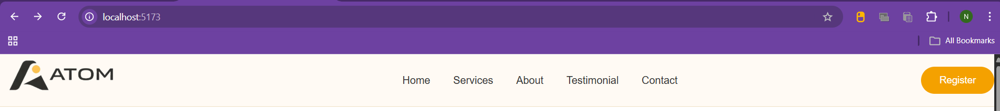
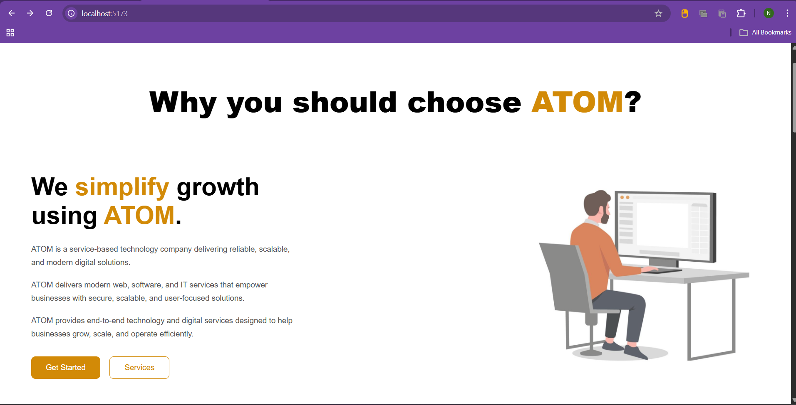
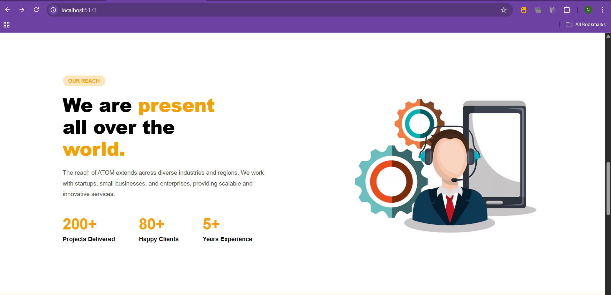
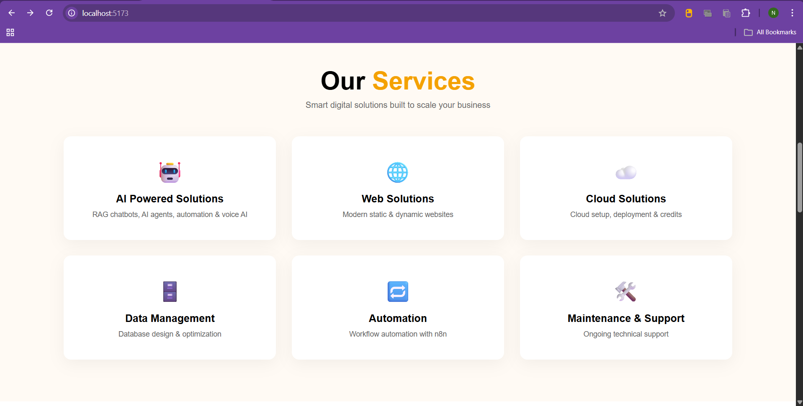
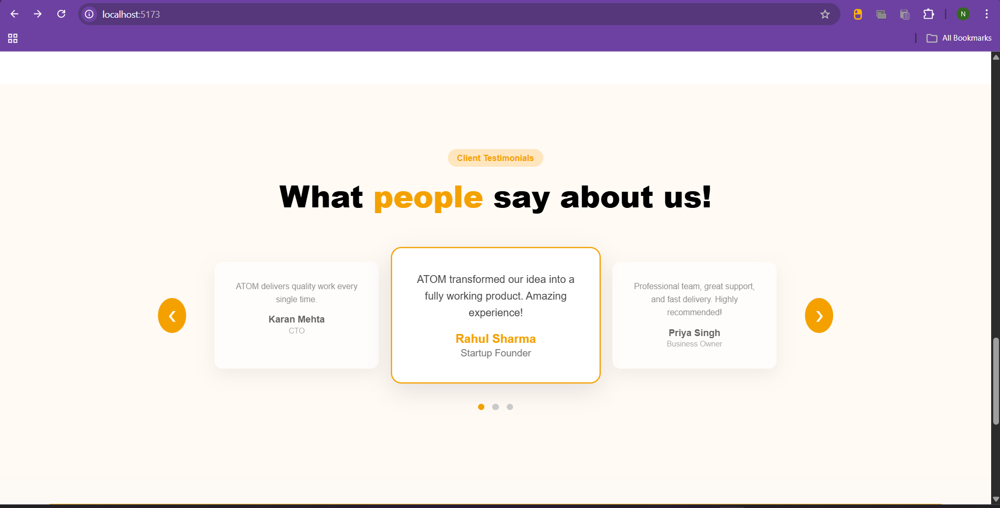
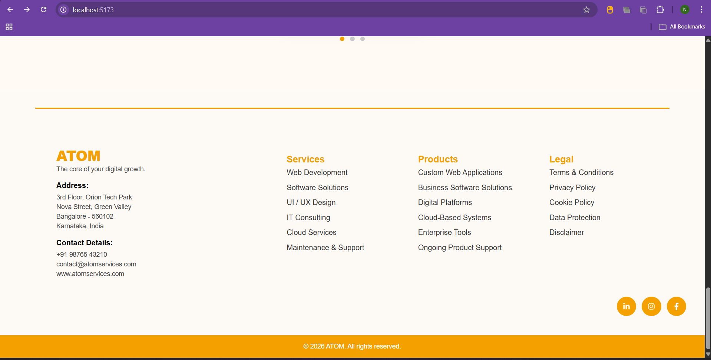

# ATOM Website 🚀

A modern service-based company website built using React and Vite.

This website showcases ATOM’s services, company information, testimonials, and contact details with a clean and responsive UI.

---

## 🔥 Tech Stack
- React.js
- Vite
- CSS
- React Router DOM

---

## 📸 Screenshots

### 🔹 Navbar


### 🔹 Home Section


### 🔹 About Section


### 🔹 Services Section


### 🔹 Testimonials Section


### 🔹 Contact Section


---

## ⚙️ How To Run Locally

```bash
npm install
npm run dev
